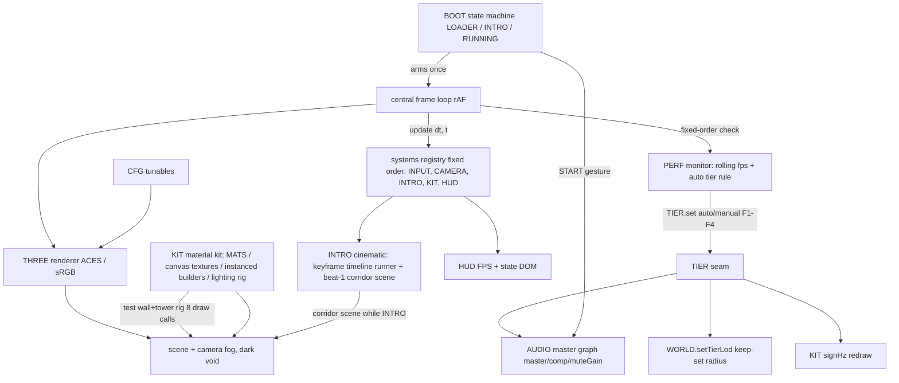

# System architecture

Single self-contained `index.html` (Three.js via CDN importmap is the only external, pinned to r0.160.0 — see [[three-cdn-pin-boot-watchdog]]). Everything lives inside the one file: a `systems` registry that boots in a fixed order, a central `frame()` rAF loop calling `update(dt, t)`, and the `BOOT` deterministic state machine (`LOADER → INTRO → RUNNING`, error path via watchdog — the intro auto-plays at module init, see [[m121-intro-timeline-runner]]). M0–M1 skeleton in place: `CFG` (tunables), `BOOT`, `AUDIO` (gesture-gated Web Audio master graph — M11.1, see [[m111-audio-master-graph]]; M11.2+ beds/events connect to `AUDIO.master`), `HUD` (FPS/state DOM), `window.SIM` dev handle (now also exposes `INTRO`). M2 adds the `KIT` material kit: shared `MATS` library, canvas-texture factory (LED grid, holo signs, glow), `InstancedBox`/`InstancedCylinder` builders, merged-geometry batcher, lighting rig (hemi + moon key + 2 reserved hero point lights), and a temporary gate test wall/tower at (0,0,-80) rendered at 8 draw calls [[m2-material-kit]]. The M12 `INTRO` system (registered after CAMERA / before KIT) owns the intro cinematic: a camera-keyframe timeline runner plus the beat-1 corridor scene, rendered instead of the city while `BOOT.state === 'INTRO'` [[m121-intro-timeline-runner]]. M14.1 adds `PERF` — deliberately NOT a registered system (fixed-order check in `frame()`): the rolling FPS monitor + auto quality tier, with the M6.2 `TIER` seam as the single funnel for auto-detect and the F1–F4 manual keys; `TIER.set()` fans out to `WORLD.setTierLod()` (keep-set radius), `KIT` holo-sign redraw rate, and `AUDIO._applyTier()` (bed gain) [[m141-perf-monitor-quality-tiers]].

## Module graph

## Constraints

- One file, no build system; dev-only tooling allowed under `smoke/` ([[smoke-harness-dev-tooling]]).
- Zero hand-authored meshes: `BoxGeometry`/`CylinderGeometry` primitives, `InstancedMesh`, merged geometry, canvas textures only.
- Draw-call budget < ~150 at 100 % quality; prefer instancing + instance colors.
- No references before init; every subsystem implements `{ init, update, onQuality?, onAwaken?, dispose? }`.
- three.js renders transparent `DoubleSide` objects in two passes — billboards/signs/sprites stay `FrontSide` ([[m2-material-kit]]).
- M0 gate (met): START always → live 60 fps loop; page refresh never leaves a stuck state (15 s boot watchdog).
- M2 gate (met): KIT renders test wall/tower with animated LED faces + signs at 8 draw calls (< 10).
