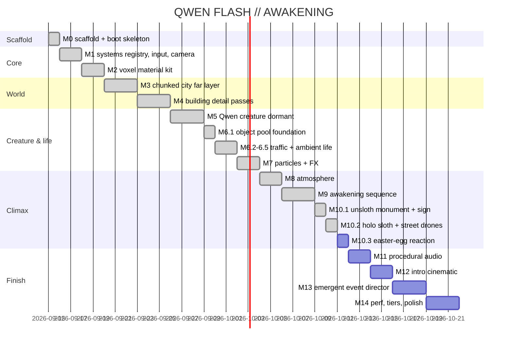

# Roadmap

Full per-milestone scope/gates live in `PLAN.md` (M0–M14, single-file demo "QWEN FLASH // AWAKENING"). Status: **M0–M10.2 done and smoke-verified headless** — M10.2 holo-sloth hologram + street-only sloth drones ([[m102-holo-sloth-drones]]); M10.1 unsloth monument + UNSLOTH sign ([[m101-sloth-monument]]); M9 awakening sequence ([[m92-wake-state-machine]], [[m94-city-cascade]], [[m95-awakening-decay]], [[m96-wake-triggers]]); M8 atmosphere ([[m81-night-sky]], [[m82-fog-zone-tint]], [[m83-light-shafts]], [[m84-distant-lightning]]); M7 particles + FX ([[m71-parts-particle-system]], [[m72-fx-pulse]], [[m73-fx-arcs]], [[m74-fx-flash]], [[m75-camera-shake]]); M6 traffic/ambient ([[m61-object-pool]], [[m62-traffic-drones]], [[m63-traffic-vehicles]], [[m64-steam-sparks]]); M5 dormant creature ([[entity-system-m5]]).

