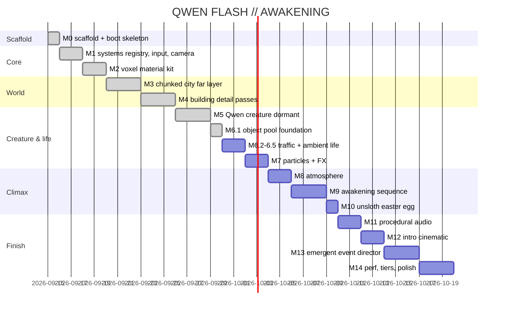

# Roadmap

Full per-milestone scope/gates live in `PLAN.md` (M0–M14, single-file demo "QWEN FLASH // AWAKENING"). Status below: M0–M5 + M6.1 done and smoke-verified headless (M5: dormant Qwen machine-creature, see [[entity-system-m5]]; M6.1: generic object-pool foundation, see [[m61-object-pool]]).

