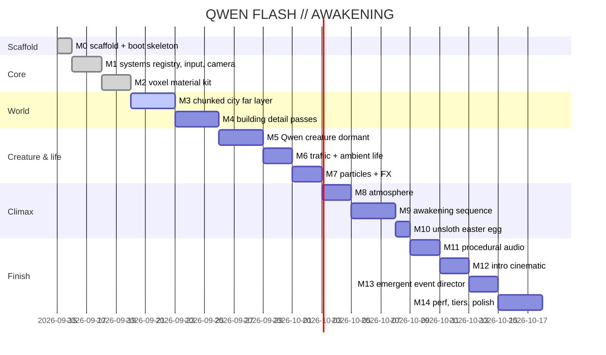

# Roadmap

Full per-milestone scope/gates live in `PLAN.md` (M0–M14, single-file demo "QWEN FLASH // AWAKENING"). Status below; M0–M2 done and smoke-verified headless (M2: KIT material kit, 8 draw-call gate test rig).

## Notes

- M2 landed `KIT` (material library, canvas textures, instanced builders, merged batcher, lighting rig) and a *temporary* gate test rig at (0,0,-80) — M3's city generator must absorb or relocate it (see [[m2-material-kit]]).
- Hero point lights are reserved in `KIT.heroLights` (intensity 0) for M5/M9/M11.
