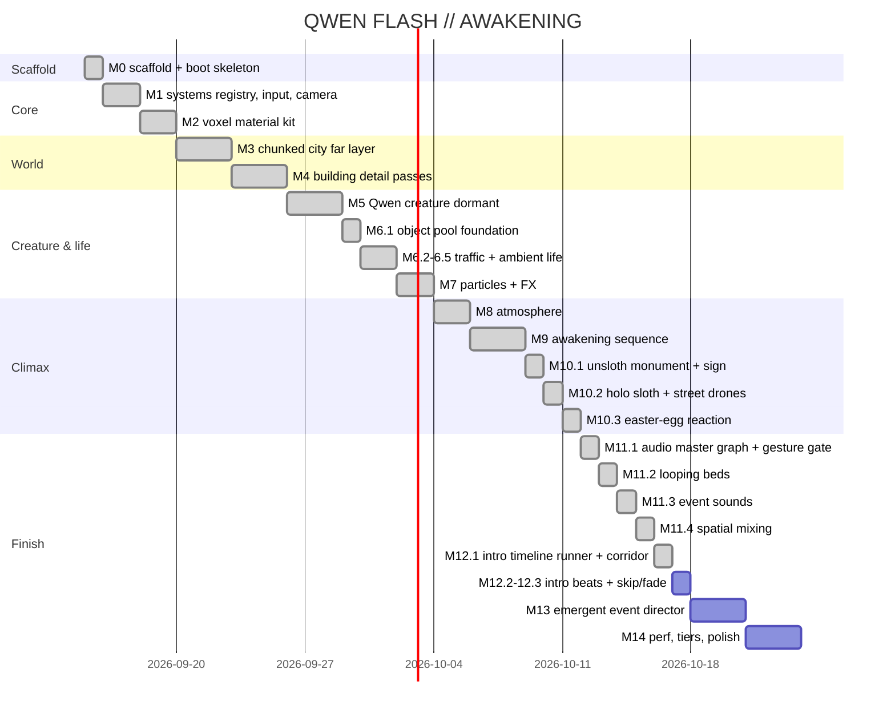

# Roadmap

Full per-milestone scope/gates live in `PLAN.md` (M0–M14, single-file demo "QWEN FLASH // AWAKENING"). Status: **M0–M12.1 done and smoke-verified headless** — M12.1 intro cinematic engine: camera-keyframe timeline runner + beat-1 dark server corridor (procedural 4-draw-call LED tunnel, dolly, handoff to street spawn) ([[m121-intro-timeline-runner]]); M11.4 spatial-ish mixing (3-channel panner pool, nearest emitters spatial, overflow folds to ambient master) ([[m114-spatial-mixing]]); M11.3 event sounds (pulse thump / arc crackle / steam hiss / drone whir, fire-and-forget one-shots on the M6–M9 emitter call sites) ([[m113-event-sounds]]); M11.2 looping beds (hum / fans / machinery, deterministic update-driven motion + random low thumps) ([[m112-looping-beds]]); M11.1 audio master graph + gesture gate + M-key mute ([[m111-audio-master-graph]]); M10.3 awakening reaction ([[m103-awakening-reaction]]); M10.2 holo-sloth hologram + street-only sloth drones ([[m102-holo-sloth-drones]]); M10.1 unsloth monument + UNSLOTH sign ([[m101-sloth-monument]]); M9 awakening sequence ([[m92-wake-state-machine]], [[m94-city-cascade]], [[m95-awakening-decay]], [[m96-wake-triggers]]); M8 atmosphere ([[m81-night-sky]], [[m82-fog-zone-tint]], [[m83-light-shafts]], [[m84-distant-lightning]]); M7 particles + FX ([[m71-parts-particle-system]], [[m72-fx-pulse]], [[m73-fx-arcs]], [[m74-fx-flash]], [[m75-camera-shake]]); M6 traffic/ambient ([[m61-object-pool]], [[m62-traffic-drones]], [[m63-traffic-vehicles]], [[m64-steam-sparks]]); M5 dormant creature ([[entity-system-m5]]).

